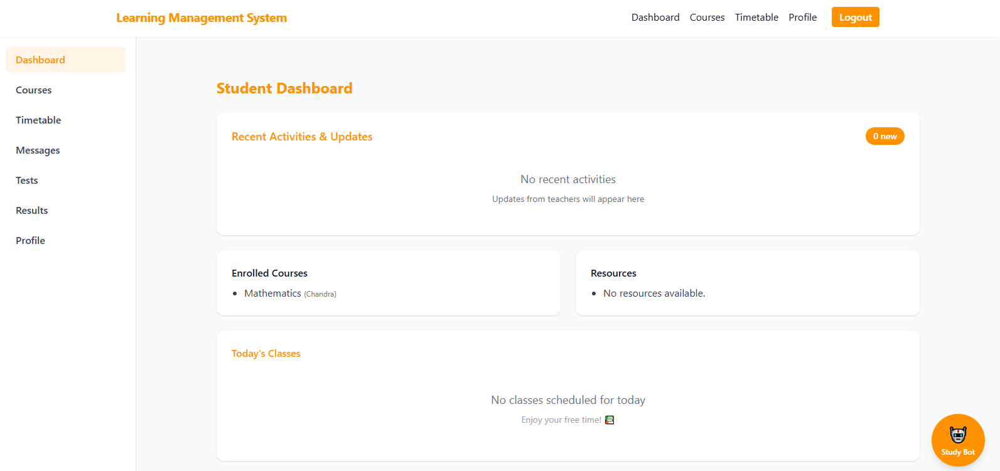
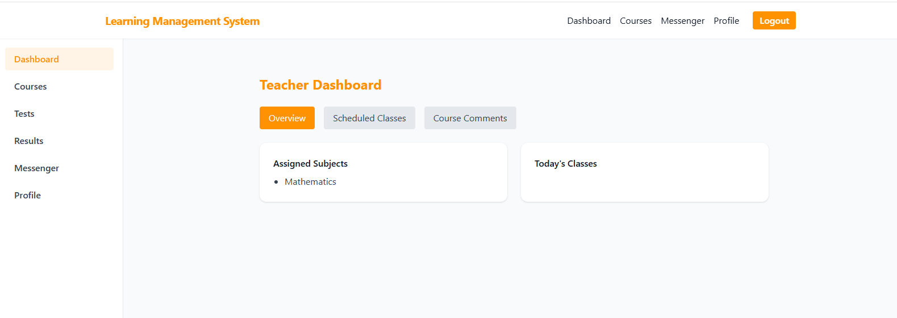
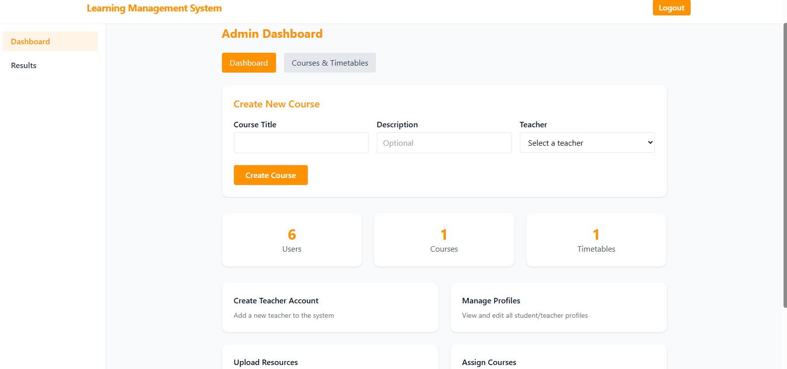

# 🎓 Learning Management System (LMS)

A comprehensive, full-stack Learning Management System built with React, Node.js, and MongoDB. This modern educational platform provides complete course management, assessment tools, and communication features for students, teachers, and administrators.


## 📋 Table of Contents

- [Features](#-features)
- [Demo](#-demo)
- [Tech Stack](#-tech-stack)
- [Quick Start](#-quick-start)
- [Project Structure](#-project-structure)
- [API Documentation](#-api-documentation)
- [Deployment](#-deployment)
- [Contributing](#-contributing)
- [License](#-license)

## ✨ Features

### 🎯 Multi-Role Authentication
- **Students**: Self-registration with email verification
- **Teachers**: Admin-controlled creation with welcome emails
- **Admins**: Secure first admin setup with unique registration numbers
- **JWT-based** secure authentication with role-based access control

### 👨‍🎓 Student Features
- 📊 **Interactive Dashboard** with today's classes and recent activities
- 📚 **Course Management** with resource access and progress tracking
- 📅 **Personal Timetable** with card-based modern UI
- 🧪 **Assessment System** with MCQ and theory-based tests
- 💬 **Communication Tools** for teacher messages and course comments
- 🤖 **Study Bot** AI assistant for notes and reminders
- 📱 **Responsive Design** for all devices

### 👨‍🏫 Teacher Features
- 📈 **Teaching Dashboard** with scheduled classes and student management
- 📁 **Resource Upload** for files, links, and course materials
- ✍️ **Assessment Creation** with auto-grading for MCQs
- 📨 **Messenger System** for student communication
- 📊 **Performance Analytics** for student progress tracking
- ⏰ **Timetable Management** for class scheduling

### 👨‍💼 Admin Features
- 👥 **User Management** for teachers and students
- 📚 **Course Administration** with assignment capabilities
- ⏰ **Timetable Management** with conflict detection
- 📊 **System Analytics** and performance monitoring
- 🔧 **System Configuration** and maintenance tools

### 🔒 Security Features
- **Password Security**: bcrypt hashing with salt rounds
- **JWT Tokens**: Secure session management with expiration
- **Input Validation**: Comprehensive data sanitization
- **File Security**: Type and size validation for uploads
- **Role-Based Access**: Granular permission control

## 🚀 Demo

### Live Demo
- **Frontend**: [LMS Demo](https://your-demo-url.com)
- **Backend API**: [API Documentation](https://your-api-docs.com)

### Screenshots
<details>
<summary>📱 Click to view screenshots</summary>

#### Student Dashboard


#### Teacher Dashboard


#### Admin Dashboard


#### Course Management


#### Assessment System


</details>

## 🛠 Tech Stack

### Frontend
- **React 18.2.0** - Modern UI library with hooks
- **React Router DOM 6.22.3** - Client-side routing
- **Tailwind CSS 3.4.3** - Utility-first styling
- **Axios 1.4.0** - HTTP client for API communication
- **React Icons 5.5.0** - Icon library
- **Vite 4.5.0** - Build tool and dev server

### Backend
- **Node.js** - JavaScript runtime environment
- **Express.js 5.1.0** - Web application framework
- **MongoDB 8.16.4** - NoSQL database
- **Mongoose** - MongoDB object modeling
- **JWT 9.0.2** - Authentication tokens
- **bcryptjs 3.0.2** - Password hashing
- **Multer 2.0.2** - File upload handling
- **Nodemailer 7.0.5** - Email functionality

### Development Tools
- **Nodemon** - Development server with auto-restart
- **ESLint** - Code linting
- **Prettier** - Code formatting

## ⚡ Quick Start

### Prerequisites
- Node.js (v16 or higher)
- MongoDB (v4.4 or higher)
- npm or yarn package manager

### 1. Clone the Repository
```bash
git clone https://github.com/yourusername/lms-project.git
cd lms-project
```

### 2. Backend Setup
```bash
cd lms-server
npm install
cp .env.example .env
nano .env
```

**Environment Variables (.env):**
```env
PORT=5000
NODE_ENV=development
MONGO_URI=mongodb://localhost:27017/lms
JWT_SECRET=your-super-secret-jwt-key
EMAIL_HOST=smtp.gmail.com
EMAIL_PORT=587
EMAIL_USER=your-email@gmail.com
EMAIL_PASS=your-app-password
```

```bash
mkdir uploads
npm run dev
```

### 3. Frontend Setup
```bash
cd lms-client
npm install
cp .env.example .env
nano .env
```

**Environment Variables (.env):**
```env
VITE_API_BASE_URL=http://localhost:5000/api
```

```bash
npm run dev
```

### 4. Create Admin User
```bash
cd lms-server
npm run setup-admin
```

### 5. Access the Application
- **Frontend**: http://localhost:5173
- **Backend API**: http://localhost:5000

## 📁 Project Structure

```
lms-project/
├── lms-client/                 # React Frontend
│   ├── src/
│   │   ├── components/         # Reusable components
│   │   ├── pages/             # Page components
│   │   │   ├── auth/          # Authentication pages
│   │   │   ├── student/       # Student pages
│   │   │   ├── teacher/       # Teacher pages
│   │   │   └── admin/         # Admin pages
│   │   ├── routes/            # Route protection
│   │   ├── context/           # React context
│   │   ├── api/               # API configuration
│   │   └── App.jsx            # Main app component
│   ├── package.json
│   └── vite.config.js
├── lms-server/                 # Node.js Backend
│   ├── controllers/           # Business logic
│   ├── models/                # Database schemas
│   ├── routes/                # API endpoints
│   ├── middleware/            # Custom middleware
│   ├── utils/                 # Helper functions
│   ├── uploads/               # File storage
│   ├── index.js               # Server entry
│   └── package.json
└── README.md
```

## 📚 API Documentation

### Authentication Endpoints
- `POST /api/auth/login` - User login
- `POST /api/auth/register` - Student registration
- `POST /api/student/forgot-password` - Password reset
- `POST /api/teacher/forgot-password` - Password reset

### Student Endpoints
- `GET /api/student/dashboard` - Student dashboard
- `GET /api/student/courses` - Enrolled courses
- `GET /api/student/timetable` - Personal timetable
- `GET /api/teacher/student-tests` - Available tests

### Teacher Endpoints
- `GET /api/teacher/dashboard` - Teacher dashboard
- `GET /api/teacher/courses` - Teaching courses
- `POST /api/teacher/upload-resource` - Upload materials
- `POST /api/teacher/messenger` - Send messages

### Admin Endpoints
- `POST /api/admin/create-teacher` - Create teacher account
- `GET /api/admin/teachers` - List teachers
- `POST /api/admin/assign-course` - Assign courses
- `POST /api/admin/assign-timetable` - Assign timetables

**For complete API documentation, see [API.md](docs/API.md)**

## 🚀 Deployment

### Production Deployment

#### 1. Build Frontend
```bash
cd lms-client
npm run build
```

#### 2. Configure Environment
```bash
cd lms-server
cp .env.example .env.production
nano .env.production
```

#### 3. Start Production Server
```bash
npm install -g pm2
pm2 start index.js --name "lms-backend"
pm2 save
pm2 startup
```

### Docker Deployment
```bash
docker-compose up -d
```

### Cloud Deployment
- **Heroku**: [Deploy to Heroku](docs/deployment/heroku.md)
- **Vercel**: [Deploy to Vercel](docs/deployment/vercel.md)
- **AWS**: [Deploy to AWS](docs/deployment/aws.md)

## 🤝 Contributing

We welcome contributions! Please see our [Contributing Guide](CONTRIBUTING.md) for details.

### Development Setup
1. Fork the repository
2. Create a feature branch (`git checkout -b feature/amazing-feature`)
3. Commit your changes (`git commit -m 'Add amazing feature'`)
4. Push to the branch (`git push origin feature/amazing-feature`)
5. Open a Pull Request

### Code Style
- Use ESLint and Prettier for code formatting
- Follow React best practices
- Write meaningful commit messages
- Add tests for new features

## 📊 Performance

- **Frontend**: Optimized with Vite for fast builds
- **Backend**: Efficient MongoDB queries with indexing
- **File Uploads**: Streamlined with Multer
- **Authentication**: JWT tokens for stateless sessions

## 🔒 Security

- **Authentication**: JWT with bcrypt password hashing
- **Authorization**: Role-based access control
- **Input Validation**: Comprehensive data sanitization
- **File Security**: Type and size validation
- **CORS**: Configured for secure cross-origin requests

## 📈 Roadmap

### Upcoming Features
- [ ] Real-time chat system
- [ ] Video conferencing integration
- [ ] Mobile application
- [ ] Advanced analytics dashboard
- [ ] AI-powered content recommendations

### Technical Improvements
- [ ] Microservices architecture
- [ ] Redis caching
- [ ] Docker containerization
- [ ] CI/CD pipeline
- [ ] API documentation with Swagger

## 🐛 Bug Reports

If you find a bug, please create an issue with:
- Bug description
- Steps to reproduce
- Expected vs actual behavior
- Browser/OS information
- Screenshots (if applicable)

## 📞 Support

- **Documentation**: [Full Documentation](docs/)
- **Issues**: [GitHub Issues](https://github.com/yourusername/lms-project/issues)
- **Discussions**: [GitHub Discussions](https://github.com/yourusername/lms-project/discussions)
- **Email**: support@yourlms.com


## 🙏 Acknowledgments

- React team for the amazing framework
- MongoDB team for the database
- Tailwind CSS for the styling framework
- All contributors and supporters

---

<div align="center">

**Made with ❤️ by the LMS Development Team**

[](https://github.com/yourusername/lms-project/stargazers)
[](https://github.com/yourusername/lms-project/network)
[](https://github.com/yourusername/lms-project/issues)
[](https://github.com/yourusername/lms-project/pulls)

</div> 