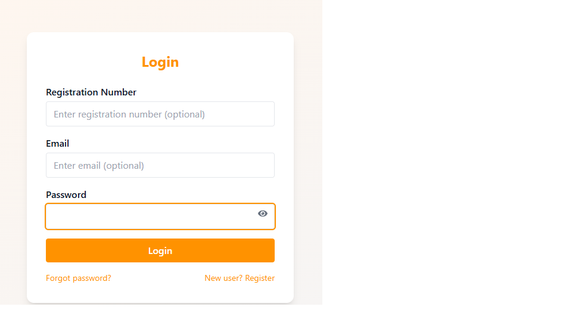
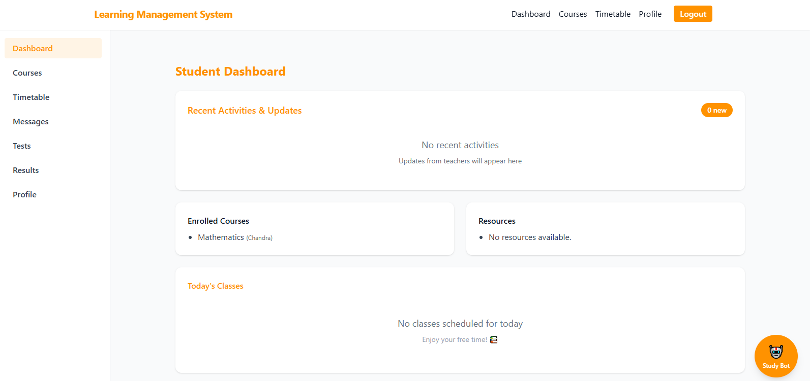
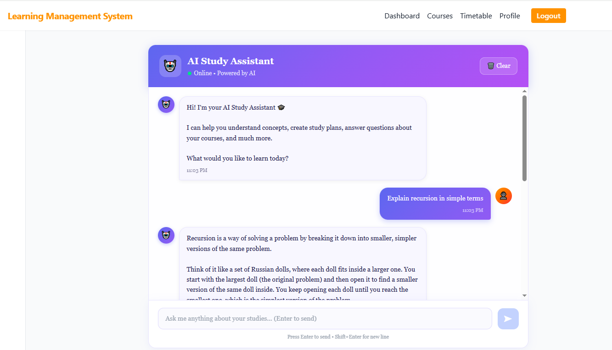
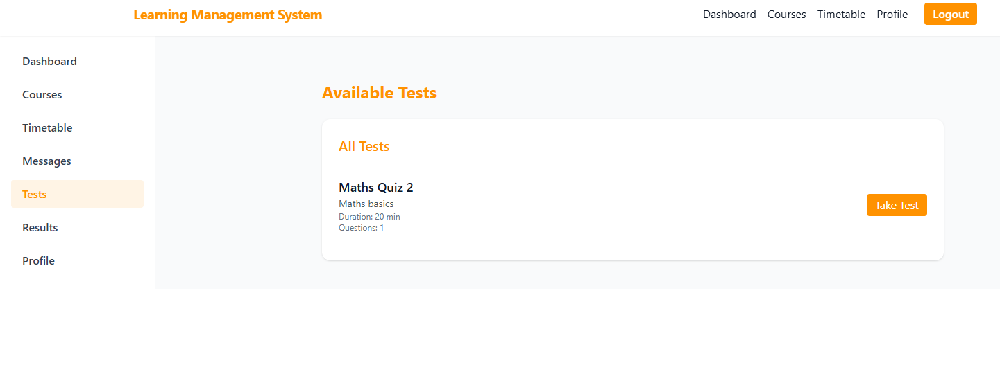
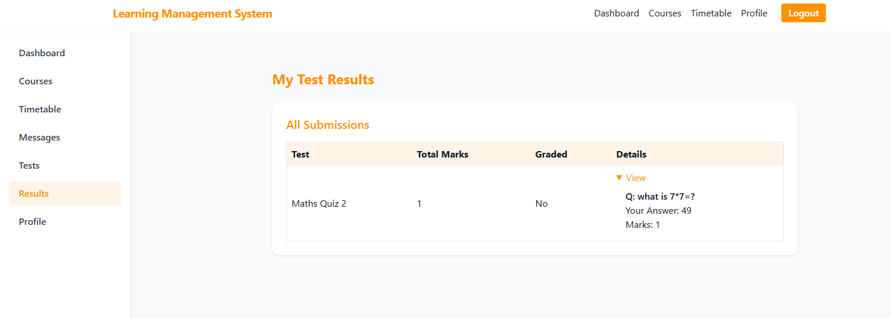
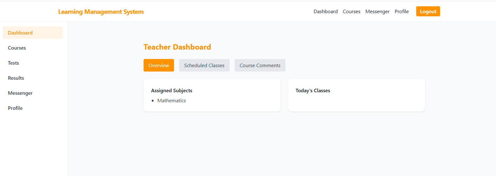
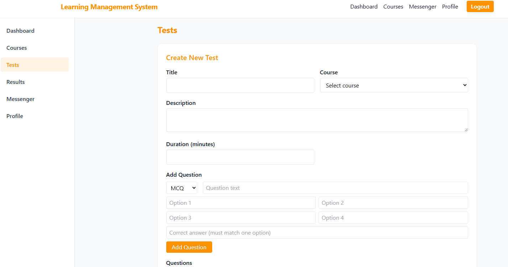
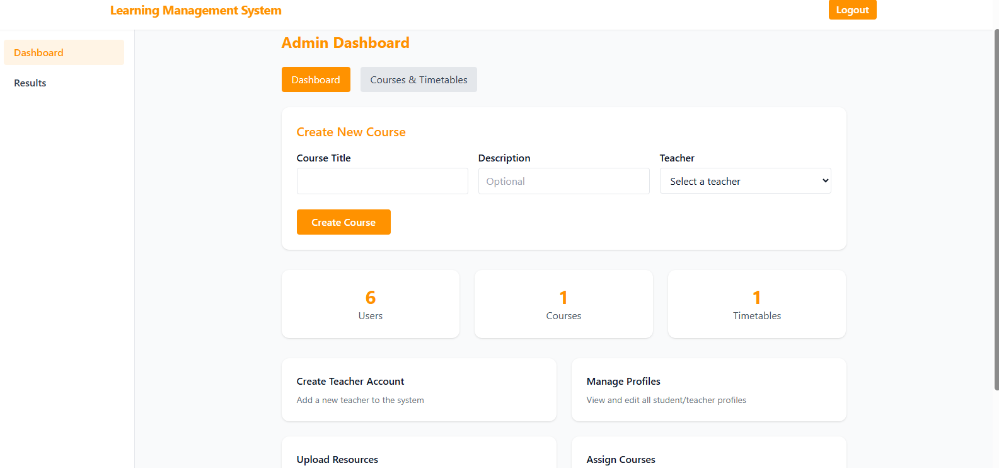

# 🎓 Smart Learn — Learning Management System

A full-stack **Learning Management System** built with React + Vite and Node.js + Express + MongoDB, supporting three user roles: Students, Teachers, and Admins. Features an AI-powered Study Bot using the Groq API (Llama 3.3 70B).


---

## 📸 Screenshots

<details>
<summary>👆 Click to view screenshots</summary>

### Login


### Student Dashboard


### AI Study Bot


### Student Tests


### Results


### Teacher Dashboard


### Teacher Test Management


### Admin Dashboard


</details>
---

## ✨ Features

### 🎯 Multi-Role Authentication
- JWT-based login for Students, Teachers, and Admins
- OTP email verification for password reset
- Role-based route protection on both frontend and backend

### 👨‍🎓 Student
- Dashboard with enrolled courses, resources and today's classes
- Take MCQ and theory tests with timer
- View results and performance summary
- AI Study Bot powered by Groq (Llama 3.3 70B)
- Notes and reminders
- Timetable and messages from teachers

### 👨‍🏫 Teacher
- Dashboard with assigned subjects and class schedule
- Create, publish and manage tests (MCQ + theory)
- Grade theory submissions and give feedback
- Upload course resources (PDF, image, video)
- Messenger to communicate with students
- View student performance summaries

### 👨‍💼 Admin
- Create teacher accounts
- Create courses and assign teachers
- Enroll students into courses
- Assign timetables
- View all results across the platform
- Monitor system stats (users, courses, timetables)

---

## 🛠 Tech Stack

### Frontend
- React 18 + Vite
- React Router DOM
- Axios
- Tailwind CSS
- Framer Motion

### Backend
- Node.js + Express 5
- MongoDB + Mongoose
- JWT Authentication
- bcryptjs
- Multer (file uploads)
- Nodemailer (OTP emails)
- Groq SDK (AI Study Bot)

### Security
- MongoDB injection sanitization
- Secure HTTP headers
- Rate limiting on login endpoints
- JWT identity binding (no client-trusted IDs)
- Environment-gated debug endpoints

---

## ⚡ Getting Started

### 1. Clone the repo
```bash
git clone https://github.com/sivakrishna916/smart-learn-lms.git
cd smart-learn-lms
```

### 2. Backend setup
```bash
cd lms-server
npm install
cp .env.example .env
# Fill in your MONGO_URI, JWT_SECRET, and GROQ_API_KEY in .env
npm run setup-admin
npm run dev
```

Backend runs on: `http://localhost:5000`

### 3. Frontend setup
```bash
cd lms-client
npm install
cp .env.example .env
# Set VITE_API_BASE_URL=http://localhost:5000/api
npm run dev
```

Frontend runs on: `http://localhost:5173`

---
## 🏥 Health Check

The backend exposes a health endpoint to check server and database status:
```
GET http://localhost:5000/health
```

Response when healthy:
```json
{
  "status": "ok",
  "database": "connected"
}
```

Response when database is down:
```json
{
  "status": "degraded",
  "database": "disconnected"
}
```

## 🔐 Environment Variables

### `lms-server/.env`
```
PORT=5000
NODE_ENV=development
MONGO_URI=your_mongodb_atlas_uri
JWT_SECRET=your_jwt_secret
EMAIL_HOST=smtp.gmail.com
EMAIL_PORT=587
EMAIL_USER=your_email@gmail.com
EMAIL_PASS=your_app_password
GROQ_API_KEY=your_groq_api_key
ENABLE_DEBUG_ENDPOINTS=false
ADMIN_NAME=Your Name
ADMIN_EMAIL=your_email@gmail.com
ADMIN_PASSWORD=your_password
```

### `lms-client/.env`
```
VITE_API_BASE_URL=http://localhost:5000/api
```

---

## 📚 API Overview

### Auth
| Method | Endpoint | Access |
|--------|----------|--------|
| POST | `/api/auth/login` | Public |
| POST | `/api/auth/register` | Public |
| POST | `/api/auth/forgot-password` | Public |
| POST | `/api/auth/reset-password` | Public |
| POST | `/api/auth/change-password` | Authenticated |

### Student
| Method | Endpoint | Access |
|--------|----------|--------|
| GET | `/api/student/dashboard` | Student |
| GET | `/api/student/profile` | Student |
| GET/POST | `/api/student/study-bot` | Student |
| GET | `/api/student/timetable` | Student |
| GET | `/api/student/notes` | Student |
| GET | `/api/student/reminders` | Student |

### Teacher
| Method | Endpoint | Access |
|--------|----------|--------|
| POST | `/api/teacher/create-test` | Teacher |
| POST | `/api/teacher/publish-test` | Teacher |
| GET | `/api/teacher/tests` | Teacher |
| POST | `/api/teacher/grade-submission` | Teacher |
| GET | `/api/teacher/results` | Teacher |

### Admin
| Method | Endpoint | Access |
|--------|----------|--------|
| POST | `/api/admin/create-teacher` | Admin |
| POST | `/api/admin/courses` | Admin |
| POST | `/api/admin/assign-course` | Admin |
| POST | `/api/admin/assign-timetable` | Admin |
| GET | `/api/admin/monitor` | Admin |

---

## 🧪 Running Tests

```bash
cd lms-server
npm test
```

---

## 📁 Project Structure

```
smart-learn-lms/
├── lms-client/
│   ├── src/
│   │   ├── pages/
│   │   │   ├── admin/
│   │   │   ├── teacher/
│   │   │   ├── student/
│   │   │   └── auth/
│   │   ├── components/
│   │   ├── context/
│   │   └── routes/
│   └── package.json
├── lms-server/
│   ├── controllers/
│   ├── middleware/
│   ├── models/
│   ├── routes/
│   ├── utils/
│   ├── config/
│   ├── test/
│   └── package.json
└── screenshots/
```

---

## 🗺 Roadmap
- [ ] Deploy to Render + Vercel
- [ ] Add CI pipeline for lint/test/build
- [ ] Improve integration test coverage
- [ ] Add real-time notifications